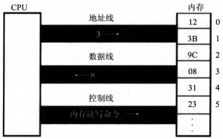

###  1.7CPU对存储器的读写
```
在上节的课程中讲到，存储器被划分成多个存储单元，存储单元从零开始顺序编号。

这些编号，可以看做是在存储器中的地址。

就像一条街，每个房子都有门牌号。

```
```
CPU要从内存中读取数据，首先要指定存储单元的地址。

也就是说，它要先确定它要读取哪一个存储单元中的数据。

就像在一条街上找人，先要确定他住在哪个房子里。
```

```
另外，在一台微机中，不只是有存储器这一种器件。

CPU在读写数据时，还要指明它要对哪一个器件进行操作。

进行哪种操作？是从中读出数据？还是向里面写入数据？
```

可见，CPU要想进行数据的读写，必须和外部器件（标准的说法是芯片）进行下面3类信息的交互：

```
    （1）存储单元的地址（地址信息）；

    （2）器件的选择，读或写的命令（控制信息）；

    （3）读或写的数据（数据信息）。

```

那么CPU是通过什么将地址，数据、控制信息传到存储器芯片中的呢？电子计算机能处理、传输的信息都是电信号，电信号当然要用导线传送。

在计算机中专门有连接CPU和其他芯片的导线，通常称为总线。

总线从物理上来讲，就是一根根的导线集合。

根据传送信息的不同，总线从逻辑上又分为3类：

```
    （1）地址总线

    （2）控制总线

    （3）数据总线

```

CPU从3号单元中读取数据的过程，如下图：



```
    （1）CPU通过地址线将地址信息3发出。

    （2）CPU通过控制线发出内存读命令，选中存储器芯片。并通知它，将要从中读取数据。

    （3）存储器将3号单元中的数据8通过数据线送入CPU。

```

 写操作与读操作的步骤相似。如向3号单元写入数据26。

```
    （1）CPU通过地址线将地址信息3发出。

    （2）CPU通过控制线发出内存写命令，选中存储器芯片。并通知它，要向其中写入数据。

    （3）CPU通过数据线将数据26送入到内存的3号单元中。

```

要让一个计算机或微处理器工作，应向它输入能够驱动它进行工作的电平信息（机器码）。

对于8086CPU，下面的机器码，能够完成从3号单元读数据。

```
机器码：101000010000001100000000

含义：从3号单元读取数据送入寄存器AX

```


CPU接收这条机器码后，将会完成我们上面所述的读写工作。


机器码难于记忆，用汇编指令表示，情况如下。

```
机器码：101000010000001100000000

对应的汇编指令：mov ax，[3]

含义：传送3号单元的内容到AX

```


